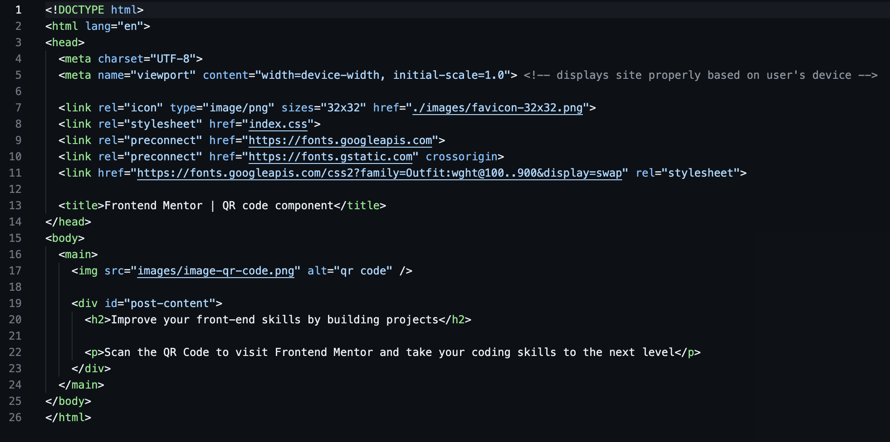
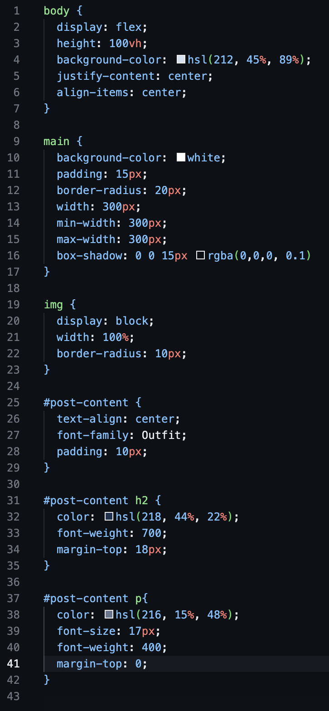

# Frontend Mentor - QR code component solution

This is a solution to the [QR code component challenge on Frontend Mentor](https://www.frontendmentor.io/challenges/qr-code-component-iux_sIO_H). Frontend Mentor challenges help you improve your coding skills by building realistic projects. 

## Table of contents

- [Overview](#overview)
  - [Screenshot](#screenshot)
  - [Links](#links)
- [My process](#my-process)
  - [Built with](#built-with)
  - [What I learned](#what-i-learned)
  - [Continued development](#continued-development)
- [Author](#author)
- [Acknowledgments](#acknowledgments)

## Overview

### Screenshot

### Links

- Solution URL: [Add solution URL here](https://your-solution-url.com)
- Live Site URL: [Add live site URL here](https://your-live-site-url.com)

## My process

### Built with

- Semantic HTML5 markup
- Flexbox (barely any)
- Basic responsive layout

### What I learned

Since this is a beginner project, I didn't learn much but, since I am a beginner, I didn't learn nothing...

- This was my first time practicing [Semantic HTML](https://developer.mozilla.org/en-US/docs/Glossary/Semantics)
- I learnt and understood the basics of responsiveness of a website
- I also learnt how to include [Google Fonts](https://fonts.google.com/) into my own webpage using the embed code

### Continued development

- Well I obviously want to focus on flexbox, it is clearly somehing important to master
- But I also want to learn how to use [Semantic HTML](https://developer.mozilla.org/en-US/docs/Glossary/Semantics) even better. I've heard it helps with SEO

## Author

- Frontend Mentor - [@VeyronShark](https://www.frontendmentor.io/profile/VeyronShark)

## Acknowledgments

I send my regards to [freeCodeCamp](https://www.freecodecamp.org) and [Colt Steele](https://www.udemy.com/user/coltsteele/?srsltid=AfmBOop0NGbVNsQdQFTNI0qbD03-TLUUHoXJpW2wvThgUzgP0JtBKV-d) who taught me concepts to tackle this problem. It was a simple one but it is a start
